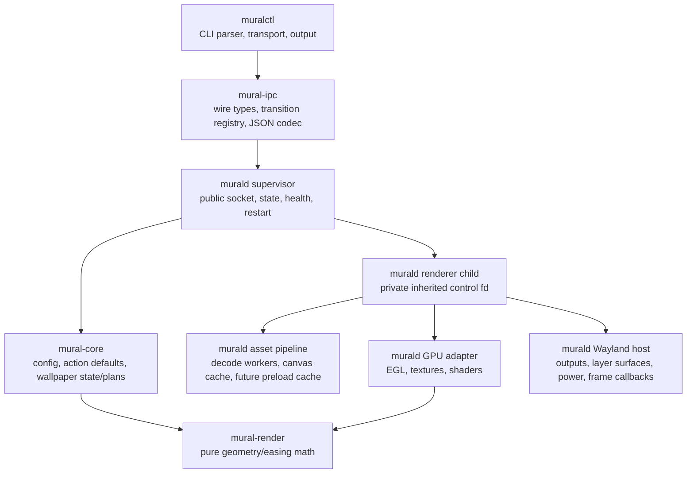
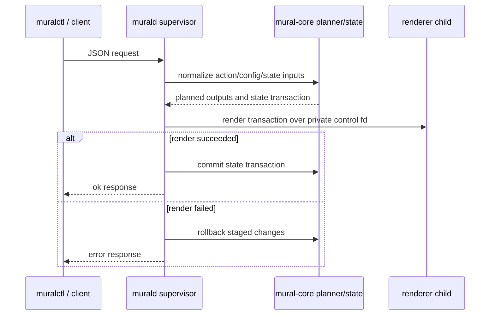

# mural architecture and guardrails

Status: 2026-08-22

These are the current design constraints future work should preserve unless the
change deliberately replaces them with something better. Keep this file short:
it is meant to prevent accidental regressions, not freeze the design.

## Source layout

The workspace is split so most future changes can start in one focused crate or
adapter instead of reading the whole daemon:

- `mural-ipc` is the compatibility boundary for scripts and `muralctl`.
- `mural-core` owns daemon-independent state and planning. It must not depend
  on Wayland, EGL, calloop, GL textures, or daemon event-loop types.
- `mural-render` stays pure math with deterministic unit tests.
- `murald` defaults to a supervisor process. The supervisor owns public IPC,
  systemd readiness/watchdog, wallpaper state, high-level command planning, and
  renderer diagnostics/restart.
- The renderer child is the same executable in `--renderer-child` mode. It owns
  Wayland/output lifecycle, EGL/GL resources, frame callbacks, swaps, decode
  workers, and canvas thumbnail cache state.
- Renderer-planning request spellings are accepted only on the inherited
  supervisor/renderer control channel. Public and standalone sockets reject
  those internal request types.

High-level state-changing wallpaper actions should keep this shape (read-only
queries and low-level renderer commands take narrower paths):

## User-visible goals

- Wallpaper changes should not blank outputs.
- `cut` should stay the snappy fast path.
- Animated transitions may do more work, but they should not make idle rendering
  or `cut` slower.
- Scripted control matters: transition type, direction, duration, easing, output
  set, scale mode, and transition mode are per-command choices, not config
  reloads.

## Rendering and Wayland model

- Keep one persistent `wlr-layer-shell` background surface per output.
- Do not destroy/recreate the active surface just to change wallpapers.
- Render through EGL/OpenGL ES for now.
- In normal supervised operation, public IPC must not share a process with
  Wayland/EGL calls. The `--standalone` mode is a debug-only exception. If the
  renderer child blocks or exits, the supervisor restarts it and restores the
  saved current wallpaper set.
- Prefer EGL swap interval 0 because mural paces animated transitions with
  explicit `wl_surface.frame` callbacks. If a driver requires a positive
  minimum interval, keep its supported throttling instead of failing startup.
- Decode image bytes off the render thread when practical. Target/full decodes
  should not share a blocking queue with lower-priority thumbnail cache warming.
- Upload GL textures only on the EGL/render thread.
- Canvas thumbnail generation must be nonblocking. Startup, `cut`, and active
  transition setup must not wait for thumbnails; use cached-ready thumbnails or
  fall back safely.
- Request Wayland frame callbacks only while an animated transition is active;
  idle outputs should not continuously wake.
- Treat frame callbacks as pacing hints, not as required progress guarantees;
  startup, configure, cut, clear, and IPC handling must not block waiting for a
  callback.

## Transition model

- A compiled-in registry is the source of public transition names, classes,
  request scopes, stability, requirements, and parameter schemas. The daemon
  exposes that registry through `muralctl capabilities`; this reports compiled
  support, not the success of runtime gates such as world-cache coverage.
- `cut` is an immediate override: replace the wallpaper now and clear queued
  work for the targeted outputs.
- Pairwise effects share target preparation, FIFO queueing, acceleration,
  rollback, and texture ownership. Fade mixes complete old and new scenes,
  including their independently scaled rectangles, clear-color regions, and
  source alpha. Push transitions are translations, not wipe/reveal masks.
- `canvas` is for high-level wallpaper actions only. It builds a stable preview
  tape from layout history plus forward shuffle-bag entries, uses the
  persistent canvas thumbnail cache for surrounding tiles, starts a
  current-centered zoom-out before target decode completes, pans along the
  configured axis until the target is centered, then zooms in. Low-level `set`
  rejects canvas because it bypasses history/shuffle state.
- Canvas modes share the same transition-mode field as push: `clipped` keeps
  the original screen-sized clipped-tile preview, `morph` reveals actual
  wallpaper aspect ratios during zoom-out and clips again during zoom-in,
  `overlap` uses overlapping full-image thumbnails, `collage` arranges
  full-image thumbnails around the current/target focus pair, and `span` treats
  outputs as viewports into one shared morph-style desktop canvas. Canvas walk
  order is separate: `paged` walks the bounded row/column canvas, while `strip`
  restores the older centered infinite-right walk. `collage` and `span`
  currently require `strip` because the paged walk is not visually stable for
  those layouts.
- Canvas overview scale controls zoom distance. Automatic tile count derives
  enough ordered preview tiles from that scale to keep current centered, pan to
  the target's natural preview position, and avoid exposing edges for typical
  high-level action distances. Manual/capped counts may expose blank canvas if
  too low.
- `world` is the full-library virtual world transition. It is not a
  `canvas.mode`; it starts only after the supervisor maps the route into the
  ordered library and verifies real disk-backed cache coverage.
- Batch requests should use one shared monotonic start timestamp for all outputs
  that begin together.
- If an animated request arrives mid-transition, keep showing every requested
  wall: queue it FIFO, speed up the active/queued transitions, and drain quickly.
- Preserve the current wallpaper on decode/upload/first-frame setup failure.
  After a request has been acknowledged and committed, a deferred pairwise GPU
  failure must restart the renderer rather than roll back only renderer-local
  state and strand queued committed work.

## Push modes

- `portal` is the default: treat the monitor as a viewport over a screen-sized
  virtual page so fill-mode overscan can slide through the viewport.
- `screen` slides only the visible crop as a flat screen-sized tile.
- `pan` keeps the experimental independently panning full-image effect.

## IPC and CLI boundaries

- Keep the JSON IPC simple and script-friendly: one request, one compact response.
- Prefer additive protocol changes; avoid breaking existing `muralctl` flags
  unless there is a clear migration path.
- `ping` is answered by the supervisor. `health` reports supervisor pid,
  renderer pid/generation, restart count, last renderer error/diagnostic, and
  per-output renderer state.
- Default batch behavior should remain all-or-nothing unless `allow_partial` is
  explicitly requested.
- Mural now owns native wallpaper selection/history/favorites/quarantine for
  `muralctl` high-level commands while preserving the low-level renderer IPC.
- The native wallpaper library is top-level-only and is updated by a
  non-recursive directory watcher; do not reintroduce per-action recursive
  scans for normal navigation commands.
- On daemon startup, once all current output surfaces are EGL-ready, display
  the saved current layout with `cut`; when no state exists, choose and persist
  the first random set. Send `sd_notify READY=1` only after that startup display
  path has completed, or immediately if there are no outputs.
- Daemon config supplies defaults for wall/state directories, scale mode, and
  high-level action transitions; CLI options remain per-command overrides.
- If the compositor exposes wlroots output-power management, treat a definite
  output-power-off state as non-renderable and defer EGL surface work, texture
  uploads, and swaps until power-on. Unknown output-power state waits for a
  definitive mode event; unsupported output-power management falls back to
  rendering normally.

## How to add or change common features

- New wallpaper action: add/extend the IPC action type, parse/build it in
  `muralctl`, plan state changes in `mural-core::wallpaper`, then keep daemon
  code limited to executing the resulting set/clear/cache work.
- New transition: add its registry descriptor and protocol/config shape first,
  put pure progress/layout math in `mural-render`, extend the shared pairwise
  lifecycle or add a bounded scene lifecycle as appropriate, and keep only GL
  drawing in the EGL adapter. Follow the exact lifecycle and verification
  checklist in [transition-authoring.md](transition-authoring.md).
- New config key: parse and test it in `mural-core::config`; daemon code should
  consume the built config, not parse environment or config files directly.
- Cache/preload work: keep cache policy and request planning separate from GL
  texture ownership. Decode can run off-thread, but texture upload and deletion
  must stay on the EGL/render thread.
- CLI or protocol change: add compatibility tests in `mural-ipc` and command
  parser tests in `muralctl` before changing daemon behavior.

Named transition profiles configure compiled-in kinds; they are not a plugin
API. The registry centralizes public metadata and capability output, while
kind-specific protocol, lifecycle, and rendering behavior remains explicit and
typed. Do not load native dynamic plugins into the renderer process.

## Regression policy

- Before installing code changes: run `cargo fmt --check`, `cargo test`, and
  `cargo clippy --all-targets --all-features -- -D warnings`.
- For renderer, transition, queue, or service changes: after installing, do one
  small live smoke test that exercises the changed path and check for obvious
  daemon errors.
